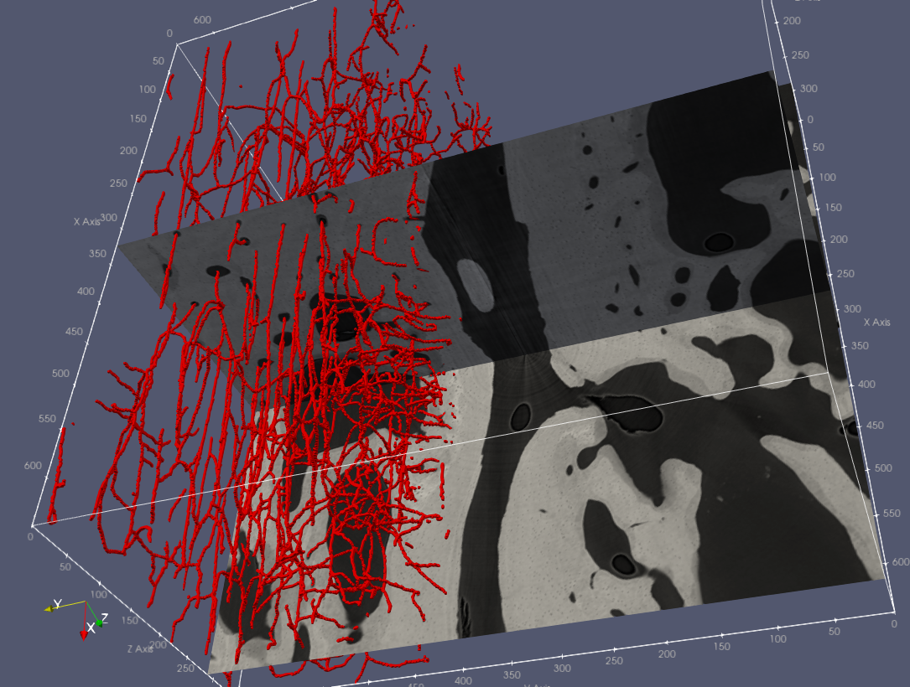
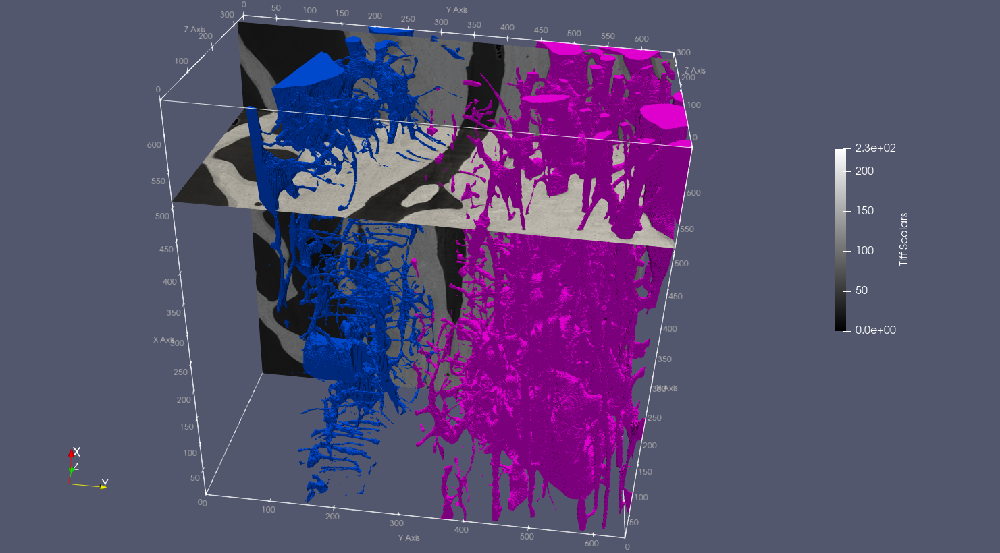

# 06.04.2021 - SXCT: from data collection to results
Lecture material for the DCH423 course - Synchrotron Radiation (SR) enabled research in Heritage Sciences and Archaeology.
###Contents:
1. [X-Ray Computed Tomography (XCT) and Synchrotron XCT (SXCT) principles](#part-1-xct-and-sxct-principles)
2. [XCT applications in Heritage and Biomedical Sciences](#part-2-xct-applications-in-heritage-and-biomedical-sciences)
3. [Getting started with 3D image processing](#part-3-getting-started-with-3d-image-processing-)
4. [Tomographic reconstruction with TomoPy (demo)](#part-4-tomographic-reconstruction-with-tomopy-demo)
5. [XCT 3D image processing hands-on session](#part-5-xct-3d-image-processing-hands-on-session)

---
### Resources
| Software ||
| :--- | --- |
| [TomoPy](https://tomopy.readthedocs.io/en/latest/) | Tomographic reconstruction in Python. |
| [Fiji (is just ImageJ)](https://fiji.sc/) | Image processing package. |
| [ParaView](https://www.paraview.org/) | An open-source, multi-platform data analysis and visualization application. |
| [3DSlicer](https://www.slicer.org/) | Open source software platform for medical image informatics, image processing, and three-dimensional visualization. |

| ImageJ plugins ||
| :--- | --- |
| [BoneJ](https://bonej.org/) | Plugins for bone image analysis in ImageJ |
| [3D ImageJ Suite](https://imagejdocu.list.lu/start) | [High-throughput 3D image analysis in ImageJ](https://academic.oup.com/bioinformatics/article/29/14/1840/231770) |
| [FeatureJ](https://imagescience.org/meijering/software/featurej/) (optional) |  |

| Python resources ||
| --- | --- |
| [BEATS/TomoPy_tests](https://gitlab.com/sesame_beats/tomopy_tests/-/tree/master/) | Gallery of TomoPy tests |
| [pyF3D by Daniela Ushizima](https://github.com/dani-lbnl/pyF3D) | High-resolution, high-performance 3D filters and morphological operaitons in Python |

---
### Part 1: XCT and SXCT principles
1. History of X-ray computed tomography (XCT)
2. XCT experimental setups
    - Cone-beam VS Parallel-beam geometries
    - CT at synchrotron facilities
    - Time resolved CT
3. Theoretical background
    - Radiographic (absorption) imaging
    - Tomographic reconstruction (FBP)
    - Edge enhancement and phase-contrast XCT
4. XCT data collection
    - Time-resolved (4D) XCT

### Part 2: XCT applications in Heritage and Biomedical Sciences
- Bernardini, Federico, Claudio Tuniz, Alfredo Coppa, Lucia Mancini, Diego Dreossi, Diane Eichert, Gianluca Turco, et al. 2012. “Beeswax as Dental Filling on a Neolithic Human Tooth.” PLoS ONE 7 (9). https://doi.org/10.1371/journal.pone.0044904.
- Dambrogio, Jana, Amanda Ghassaei, Daniel Starza Smith, Holly Jackson, Martin L. Demaine, Graham Davis, David Mills, et al. 2021. “Unlocking History through Automated Virtual Unfolding of Sealed Documents Imaged by X-Ray Microtomography.” Nature Communications 12 (1): 1–10. https://doi.org/10.1038/s41467-021-21326-w.
- Madi, Kamel, Katherine A. Staines, Brian K. Bay, Behzad Javaheri, Hua Geng, Andrew J. Bodey, Sarah Cartmell, Andrew A. Pitsillides, and Peter D. Lee. 2020. “In Situ Characterization of Nanoscale Strains in Loaded Whole Joints via Synchrotron X-Ray Tomography.” Nature Biomedical Engineering 4 (3): 343–54. https://doi.org/10.1038/s41551-019-0477-1.

### Part 3: Getting started with 3D image processing (?)
...

### Part 4: Tomographic reconstruction with TomoPy (demo)
- [ ] Read **HDF5** file
- [ ] Inspect projections and sinograms
- [ ] Flat-field correction and log transform
- [ ] Center Of Rotation (**COR**) optimization
- [ ] Tomographic reconstruction in **TomoPy**
- [ ] Apply **circular mask**
- [ ] Write output stack of **TIFFS**
- [ ] control **bitdepth** of output slices (?)
- [ ] **Phase retrieval** algorithms in TomoPy - comparison with absorption recon
- [ ] Full recon using the TomoPy **command line interface**
- [ ] Reconstruction on **Cyclone** supercomputer
- [ ] Launch reconstructions via **batch script**

### Part 5: XCT 3D image processing hands-on session
#### ImageJ - Input/Output
- [X] Loading large dataset in ImageJ
- [X] Image/Show Info
- [X] Adjust pixel size (Image/Properties)
- [X] Analyze/Measure
- [X] 3D filtering (Process/Filters/Gaussian Blur)
- [X] Rescale (Image/Scale)
- [X] Save! (File/Save As/Image Sequence)
- [X] 3D ROI crop (Plugins/Stacks/Crop (3D))
- [X] Save! (File/Save As/Image Sequence)
#### Thresholding
- [X] Manual 3D ROI selection in 3DSlicer: separate VFA and MBA
    - File/Add Data
    - **Segment Editor module**
        - Add
        - **Draw**
        - Fill between slices/Initialize/Allow overlap/Apply
        - Export as STL
        - Segmentations button
        - Export to new labelmap
    - **Segmentation module**
        - Save
- [X] Automatic thresholding in ImageJ: bone_tissue mask
    - Load (Virtual stack off)
    - Image/Adjust/Threshold
        - Otsu, Auto -> Apply
- [X] Remove noise speckles
    - Process/Noise/Despeckle

#### Morphological operations (mask refinement)
- [X] Keep largest strut (remove unconnected objects)
    - [Plugins/MorphoLibJ/Binary Images/Keep Largest Region](https://imagej.net/MorphoLibJ)
    - [Plugins/BoneJ/Purify](https://bonej.org/purify) (alternatively)
    - Image/Rename (bone_tissue)
    - File/Save As
- [X] (Alternatively) Image open (remove unconnected objects)
    - Process/Binary/Open
- [X] Logical operations on masks: VFA_tissue; MBA_tissue
    - Load MBA-VFA separation
    - Process/Binary/Make mask
    - Process/Image Calculator: `bone_tissue AND VFA_separation`
    - Plugins/MorphoLibJ/Binary Images/Keep Largest Region    
    - Image/Rename (VFA_tissue)
    - File/Save As
    - Process/Image Calculator: `bone_tissue - VFA_tissue`
    - Image/Rename (MBA_tissue)
    - File/Save As
- [X] Erode, Dilate, Open, Close: MBA_total and VFA_total
    - Plugins/MorphoLibJ/Morphological Filters (3D)
        - Closing; Cube (4x4x4)
    - Plugins/MorphoLibJ/Extend Image Borders (L1, R1, T0, B1, F1, B1)
    - Plugins/3D/3D Fill Holes
    - Plugins/Stacks/Crop 3D [1:649, 1:649, 2:350]
    - Plugins/MorphoLibJ/Binary Images/Keep Largest Region    
    - Image/Rename (MBA_total)
    - File/Save As
    - Plugins/MorphoLibJ/Morphological Filters (3D)
        - Erosion; Cube (3x3x3)
- [X] MBA_pores and VFA_pores
    - Edit/Invert `bone_tissue`
    - Process/Image Calculator: `bone_tissue AND MBA_total_eroded`
    - Process/Noise/Despeckle (necessary?)
    - Image/Rename (MBA_pores)
    - File/Save As
    
#### Quantitative analysis (ImageJ-BoneJ and Python)
- [X] BV/TV
    - Load MBA_tissue, MBA_total, VFA_tissue, VFA_total
    - Plugins/BoneJ/Fraction/Volume Fraction
- [X] Tissue density
    - Process/Image Calculator: `MBA_tissue AND cropped_rescale_025`
- [ ] Connectivity
- [ ] Thickness
    - Pores
    - Trabeculae
- [ ] Skeleton Analyzer

- [ ] Particle Analyzer

#### Computed Tomography to Finite Elements
[CT2FE](https://github.com/gianthk/CT2FE) - From 3D CT datasets to voxel-Finite Element (FE) models for the prediction of bone tissue stiffness.

#### 3D Visualization (Paraview)
- [X] Load
- [X] Slice
- [X] Threshold
- [X] Clip

